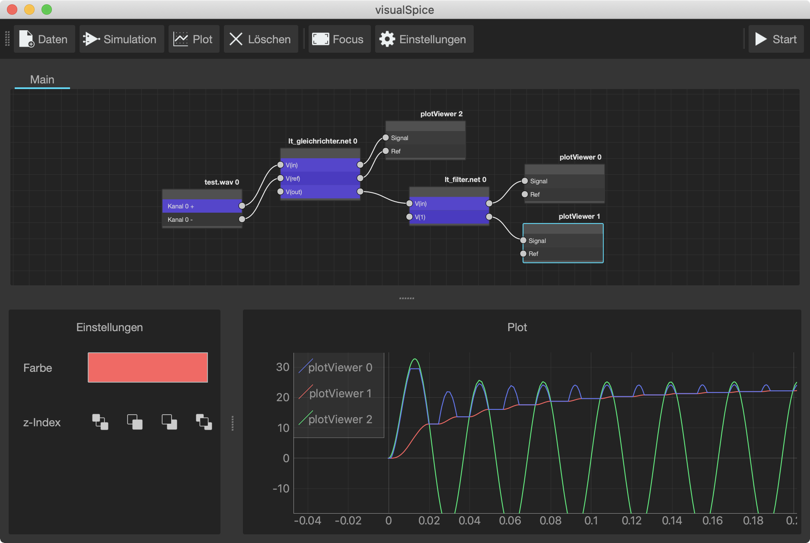

    abstrakter high-level Schaltkreis Simulator

Generiert dynamische Netlists von Simulationsblöcken, führt diese mit .wav Dateien aus und zeigt diese an.

Unterstützt [LTSpice](https://www.analog.com/en/design-center/design-tools-and-calculators/ltspice-simulator.html) und [ngspice](http://ngspice.sourceforge.net).

### Screenshots

 | 
 --- | ---
Startverhalten von Gleichrichter und Filter in LTSpice | ngspice RC Low-pass Filter

---

## Install

mit python > 3.7.7

1. Repository klonen:
    - `git --recurse-submodules clone https://github.com/playduck/visualSpice.git`
    - `cd visualSpice`
    - für ältere git Versionen `git submodule update --init --recursive`
2. _(optional)_ virtual enviornment erstellen
    - `python3 -m venv ./venv`
    - venv aktivieren (von shell zu shell anders)
        - bash `source ./venv/bin/activate`
        - powershell `./venv/Scripts/activate.ps1`
    - `pip install --upgrade pip`
3. Module installieren
    - `pip install -r requirements.txt`
4. Starten
    - `python3 visualSpice.py`

oder `make init run`

### Build

`make build` bzw. manuel, wie im [makefile](makefile#L32) mit pyinstaller

---

## TODO

- nutzerfreundliches Error handeling
- flexibleres Netlist parseing
- keyboard shortcuts
- Daten exportieren
- Simulationslänge abhängig der Eingangsdaten
- tests mit mehreren Inputs
- dynamisch plots updaten ohne neu zu simulieren (?)
- windows support und builds
